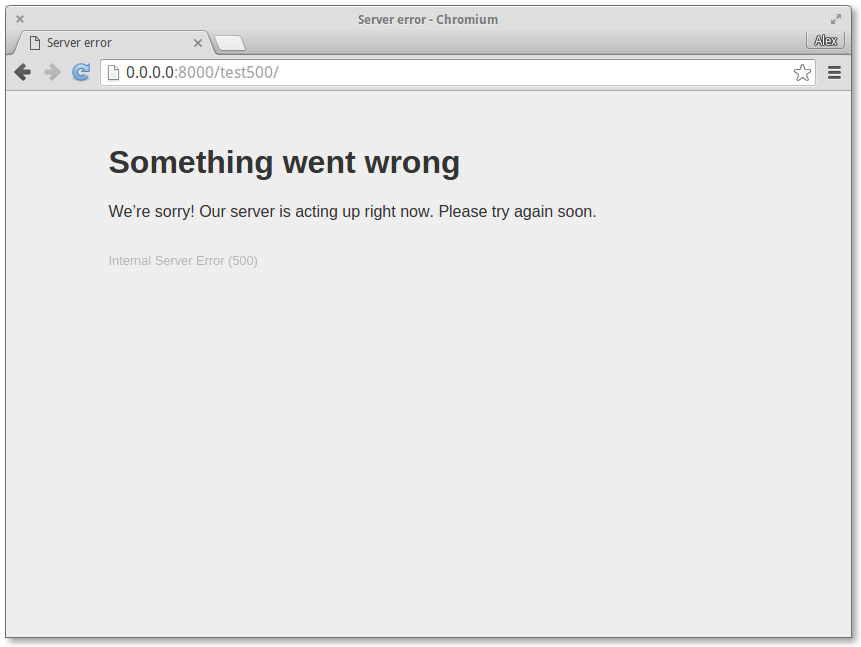

Wagtail Error Pages
===================
Pretty, smart, customizable error pages for Wagtail. It was inspired by A List Apart's article on [The Perfect 404](http://alistapart.com/article/perfect404).

#### Features:
* Simple language (no jargon)
* Search box
* Suggests pages by searching the URL
* Adjusts message depending on where the user came from
* Customizable

Messages
--------
Depending on where the user came from, the 404 message will adjust. It determines this based on the `document.referrer` property in JavaScript. If JavaScript is turned off, a generic message will be displayed instead.

Here are the possible messages for **empty referrer**, **external referrer**, **external referrer (search engine)**, and **internal referrer** respectively.

Install
-------

    pip install wagtailerrorpages

Then add `wagtailerrorpages` to your installed apps.

Usage
-----
If you don't have a `404.html` or `500.html` in the root of your templates directory, they will be pulled automatically from this app.

#### 404 Page
To override and style the 404 page, create a `404.html` in the root of your templates directory, and add the following code to the top:

    

Then, add template blocks to override features of this template. See the section below ("Extending the base404 template") for a full reference, or refer to `404base.html` inside of this repo.

#### 500 page
You can't configure the 500 page. This is by design; if there is a server error, it's possible that Wagtail will not be capable of rendering template tags, so it's best to keep this template self-contained and static.

If you'd like to make a custom one, copy the one from this app into `templates/500.html` on your app and edit it directly.

#### Testing
If you used [cookiecutter-wagtail](https://github.com/torchbox/cookiecutter-wagtail), you can visit `/test404` and `/test500` on your site in debug mode to preview the templates. If not, you can [configure your urls.py](https://github.com/torchbox/cookiecutter-wagtail/blob/23d5dd7a7ba1e442f6c8c5526d211900d05030ef/%7B%7Bcookiecutter.repo_name%7D%7D/%7B%7Bcookiecutter.repo_name%7D%7D/urls.py#L23) to allow this.

Using your own layout
---------------------
If you just want the 404 page content (message and search box), you can drop it anywhere with:

    
    

This might be useful if you'd prefer to keep the 404 page inside of your site's base layout.

Extending the base404 template
------------------------------
If you extend the base404 template with:

    

You have the ability to override parts of the page. The following is a reference for the layout's overridable template blocks.

#### Document title
Override the page title in the browser tab. It's a good idea to add the website's name at the end.

    Page not found - MySite

#### HTML meta tags
Override meta tags in the HTML head. Below is the default.

    
      <meta charset="utf-8">
      <meta http-equiv="X-UA-Compatible" content="IE=edge">
      <meta name="viewport" content="width=device-width, initial-scale=1">
    

#### Stylesheet and extra HTML head
Extra head content; put your custom stylesheet here. By default it contains the custom stylesheet, so overriding this block will remove it.

    
      <link rel="stylesheet" href="">
    

#### Page header
The top part of the page body. By default this contains the "Go home" link. You may want to include the website's logo, but avoid including a full navigation.

    
      [<a href="/">Go home</a>]
    

#### Page content
It's advised that you don't override this without a good reason. It imports the 404 message fragment.

    
      
    

#### Page footer
The bottom part of the page body. You may want to include useful links for a lost user, or legal/copyright information.

    
